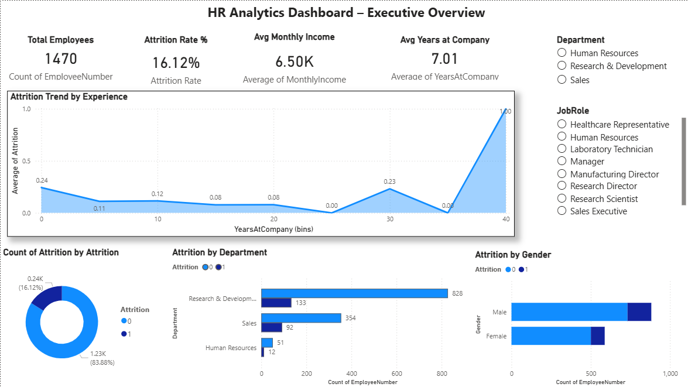
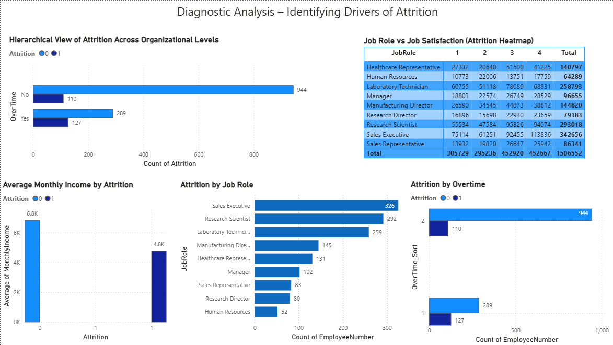
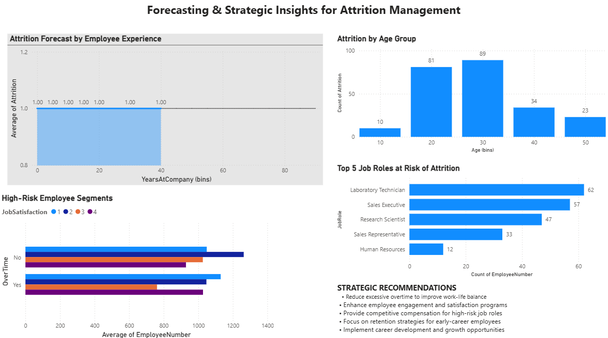

# HR Attrition Analysis Project

##  Project Overview

This project analyzes employee attrition using data analytics and visualization techniques.

## Tools Used

* Python (Pandas, NumPy, Matplotlib, Seaborn)
* Jupyter Notebook
* Power BI

## Files Included

* Jupyter Notebook (Data Analysis)
* Dashboard (Power BI)
* Report (Project Documentation)

## Key Insights

* Attrition is higher in low income groups
* Employees with less experience are more likely to leave
* Work-life balance impacts retention

## Future Scope

* Machine Learning prediction models
* Advanced forecasting

## Author

BABLI GUPTA

## 📊 Dashboard Preview

